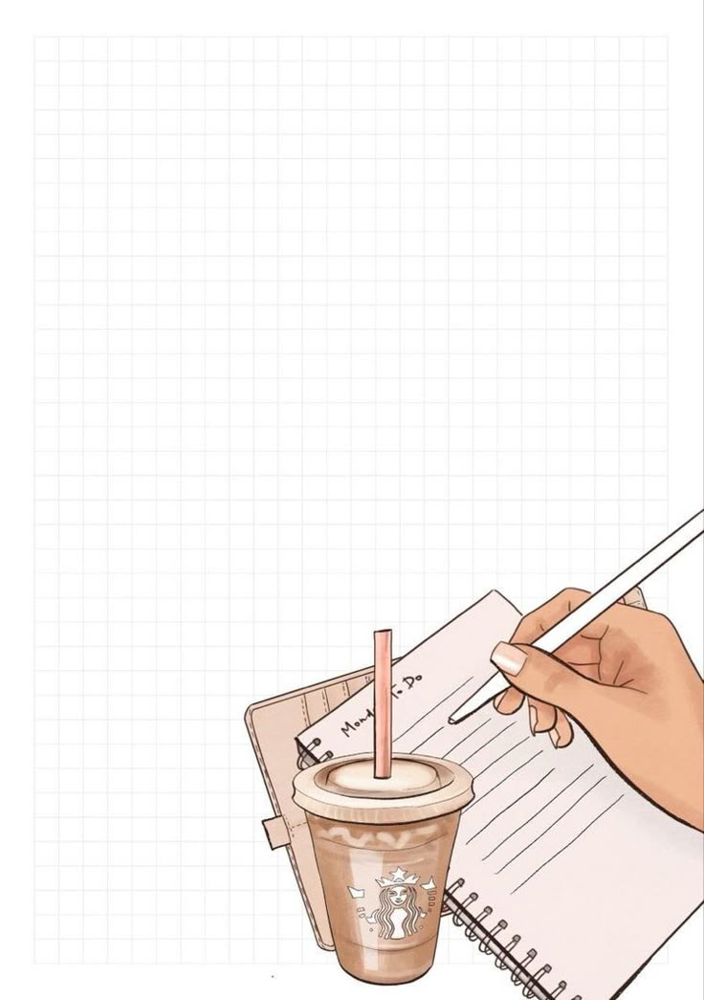

# todo-app-js😊
# 📝 Dynamic To-Do List App (Vanilla JavaScript + Responsive UI)

This is a lightweight, responsive **To-Do List Web App** built using **HTML, CSS, and JavaScript**. It allows users to add, complete, and remove tasks dynamically — all styled with a modern layout and a beautiful background image.

---

## 🚀 Features

- ✅ Add new tasks with real-time rendering
- ✅ Mark tasks as completed with a single click
- ✅ Remove tasks easily
- ✅ Input validation using `trim()` and guard clauses
- ✅ Uses `forEach()` and `filter()` for task management
- ✅ Responsive layout with mobile-first design
- ✅ Clean UI with CSS hover states, shadow effects, and card layout
- ✅ Background image integration with `background-size: cover`

---

## 📸 Preview

>   
<sub>*Sample background used in the app*</sub>

---

## 🧠 Technologies Used

- **HTML5** – Semantic structure
- **CSS3** – Modern card layout, button styles, media responsiveness
- **JavaScript (ES6+)** – DOM manipulation, arrow functions, guard clauses, `forEach()`, `filter()`, event handling

---

## 📂 Folder Structure

```bash
├── TODO.html         # Main project file
├── todoimg.jpg       # Background image
├── README.md         # Project description (you're reading it!)
